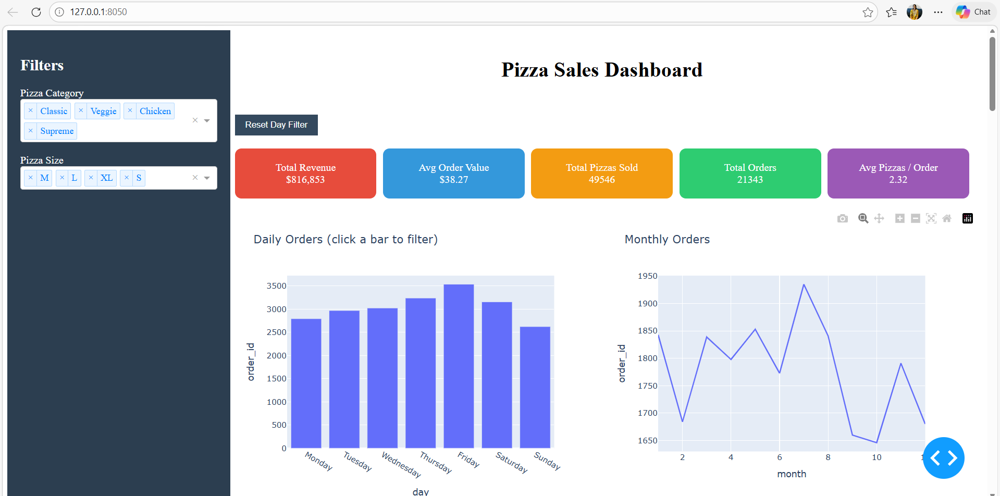

# 🍕 Pizza Sales Analysis

A comprehensive data analysis project exploring pizza sales data to uncover business insights, sales trends, and customer purchasing patterns — demonstrating the **complete Data Analytics lifecycle** from data preparation through interactive dashboard development.

---

## 📌 Project Overview

This project helps a pizza restaurant understand:

- Sales performance & revenue distribution
- Customer ordering behavior
- Product popularity across categories and sizes

---

## 🎯 Business Problem

The restaurant wants to improve its sales strategy by answering:

- Which pizzas generate the most revenue?
- When do customers place the most orders?
- Which categories and sizes sell the most?
- Which products are best — and worst — performers?

---

## 📊 Key Performance Indicators (KPIs)

| KPI | Description |
|-----|-------------|
| Total Revenue | Overall revenue generated |
| Total Orders | Number of orders placed |
| Average Order Value | Revenue per order |
| Total Pizzas Sold | Volume of pizzas sold |
| Avg Pizzas Per Order | Customer basket size |

---

## 📈 Analysis Performed

**Sales Trends**
- Daily and monthly order trends

**Product Performance**
- Top 5 best-sellers & bottom 5 worst-sellers

**Category & Size Analysis**
- Sales % by pizza category
- Revenue distribution by pizza size

---

## 🔄 Data Analytics Lifecycle

1️⃣ Business Understanding → 2️⃣ Data Collection → 3️⃣ Data Preparation → 4️⃣ EDA → 5️⃣ KPI Analysis → 6️⃣ Dashboard Development

---

## 📂 Project Structure
```
pizza-sales-analysis/
├── data/                    # Raw dataset
├── notebook/                # Jupyter analysis notebook
├── dashboard/               # Dash app
├── images/                  # Visuals & screenshots
├── documentation/           # Project report
├── requirements.txt
└── README.md
```

---

## ⚙️ Tech Stack

`Python` · `Pandas` · `NumPy` · `Matplotlib` · `Plotly` · `Dash` · `Jupyter Notebook`

---

## 🚀 Getting Started
```bash
git clone https://github.com/AnanyaMangaj/pizza-sales-analysis.git
cd pizza-sales-analysis
pip install -r requirements.txt
python dashboard/dashboard.py
```

---

## 📊 Dashboard Preview




---

## 💡 Key Insights

- Certain pizza categories drive a disproportionate share of total revenue
- Order volume shows clear day-of-week patterns
- A small set of pizzas consistently outperform the rest
- Pizza size is a significant factor in revenue contribution

---

## 📚 Dataset

Source: [Kaggle](https://www.kaggle.com) · Format: CSV · Contains order details, pizza categories, sizes, and revenue data.

---

## 👩‍💻 Author

**Ananya Mangaj** · [GitHub](https://github.com/AnanyaMangaj)

---
